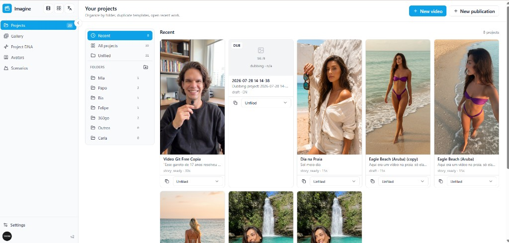
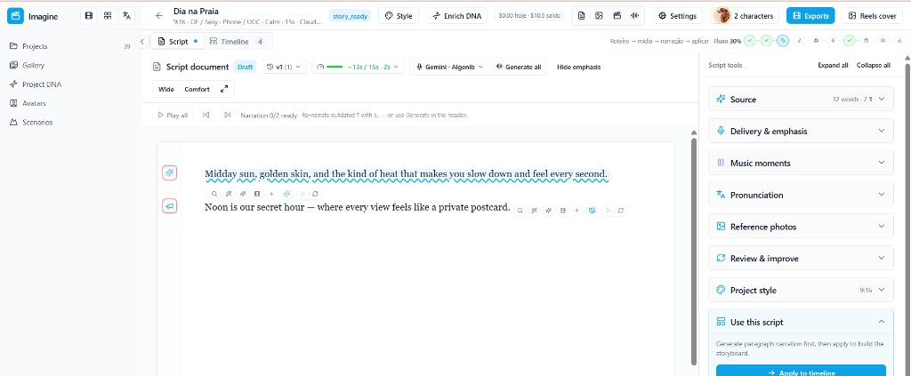
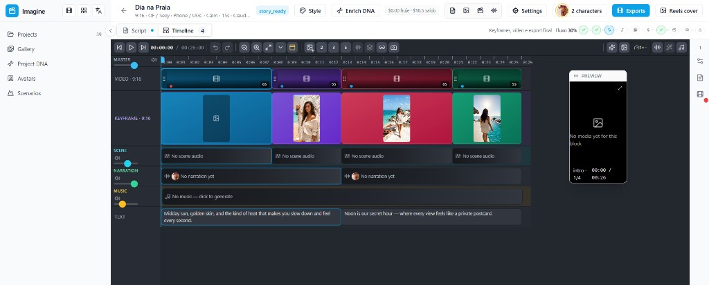

# Imagine

App web para criar vídeos com IA: da ideia ao roteiro, da timeline ao export.

Você descreve a história, o Imagine gera (ou ajuda a escrever) a narração, busca e cria imagens e clips, monta tudo numa timeline horizontal no estilo Premiere e exporta o vídeo final — com metadados para YouTube e pack para Premiere, se quiser.

## A cara do produto

### Biblioteca de projetos

Pastas, capas, status e atalhos para **New video**, **New publication** e dublagem. O trabalho recente fica à frente.



### Script Studio

Editor do roteiro: ênfase na fala, TTS, pronúncia, pausas de música e fotos de referência. Quando o texto está pronto, aplica na timeline.



### Timeline

Trilhas de vídeo, keyframe, cena, narração, música e texto, com preview vertical (Reels / 9:16) à direita.



## O que o Imagine faz

- **Vídeos de história** — brief (gênero, estilo, tom, duração, formato 9:16 / 16:9) e geração assistida por IA
- **Script Studio** — roteiro em parágrafos, ênfase, pronúncia, momentos de música, fotos e vídeos de referência
- **Timeline** — arrastar, reordenar, scrub; trilhas de vídeo, keyframe, áudio de cena, narração e música
- **Mídia** — keyframes e clips gerados por IA, ou importados (stock / busca)
- **Narração TTS** — várias vozes e modelos; entrega e ênfase por trecho
- **Project DNA, Avatars e Scenarios** — identidade visual, personagens e cenários reutilizáveis
- **Dublagem** — transcrever, traduzir e re-vozear MP4/MP3
- **Publicações** — carrosséis / slides para redes
- **YouTube** — thumbnail, títulos, descrição e tags
- **Export** — MP4 final (FFmpeg) ou ZIP se o encode falhar; pack para Premiere

## Fluxo típico

1. **Novo projeto** — ideia, formato, elenco e estilo
2. **Roteiro** — escrever ou gerar no Script Studio
3. **Pronúncia e pausas** — ajustar fala e respiros musicais
4. **Mídia** — keyframes, stock e/ou vídeo gerado por bloco
5. **Narração** — TTS por parágrafo
6. **Aplicar na timeline** — montar, reordenar, preview
7. **YouTube** — thumbnail e metadados
8. **Export** — MP4 ou pack Premiere

## Stack

| Camada | Tecnologia |
|--------|------------|
| App | Next.js 14 (App Router) + TypeScript |
| UI | Tailwind CSS + Radix |
| Auth | Clerk |
| Dados | Drizzle ORM — SQLite em dev, Postgres em produção |
| IA | OpenRouter (LLM, imagem, vídeo, TTS, música) |
| TTS extra | ElevenLabs (opcional) |
| Export | FFmpeg (`fluent-ffmpeg`), ZIP de fallback |
| Storage | disco em `public/generated/` (S3 previsto nos stacks) |

Modelos padrão (configuráveis por env):

| Uso | Modelo |
|-----|--------|
| Roteiro / metadados | `anthropic/claude-opus-4.7` |
| Imagens / thumbnail | `bytedance-seed/seedream-4.5` |
| Vídeo | `kwaivgi/kling-v3.0-pro` |
| Narração | `google/gemini-3.1-flash-tts-preview` |
| Música | `google/lyria-3-pro-preview` |

## Como rodar localmente

Pré-requisitos: Node 20+, FFmpeg no PATH.

```bash
npm install
npm run db:migrate
npm run dev
```

Abre em [http://localhost:3000](http://localhost:3000).

Crie um `.env.local` na raiz com pelo menos:

```bash
NEXT_PUBLIC_APP_URL=http://localhost:3000
DATABASE_URL=./data/app.db

NEXT_PUBLIC_CLERK_PUBLISHABLE_KEY=
CLERK_SECRET_KEY=

OPENROUTER_API_KEY=
```

Opcionais: `ELEVENLABS_API_KEY`, `PEXELS_API_KEY`, `SERPER_API_KEY`, `GOOGLE_CUSTOM_SEARCH_API_KEY` + `GOOGLE_CSE_ID` (busca de imagens/vídeos e pesquisa).

## Docker / Portainer

Stacks Swarm + Traefik em [`docker/`](docker/README.md).

Na produção, use **`docker/docker-compose.portainer.stack.yml`**.

Há também stacks de MinIO e Postgres para quem ainda não tem storage/banco no servidor.

**Storage:** o app ainda grava mídia em `public/generated/` (disco). As variáveis `S3_*` já estão nos stacks; a integração no código ainda não está completa.

## Estrutura

```
imagine/
├── src/
│   ├── app/             # rotas Next.js (projetos, script, gallery, DNA, dubs…)
│   ├── components/      # UI, Script Studio, Timeline
│   ├── lib/
│   │   ├── db/          # Drizzle (SQLite / Postgres)
│   │   └── openrouter/  # clientes de IA
│   └── middleware.ts    # Clerk
├── docs/screenshots/    # imagens deste README
├── docker/              # compose / Portainer
├── drizzle/             # migrations
├── editor-ia/           # experimento à parte (Premiere + IA)
├── public/generated/    # mídia local (gitignored)
└── data/                # SQLite (gitignored)
```

`editor-ia/` não faz parte do fluxo do app web — ver [`editor-ia/README.md`](editor-ia/README.md).
